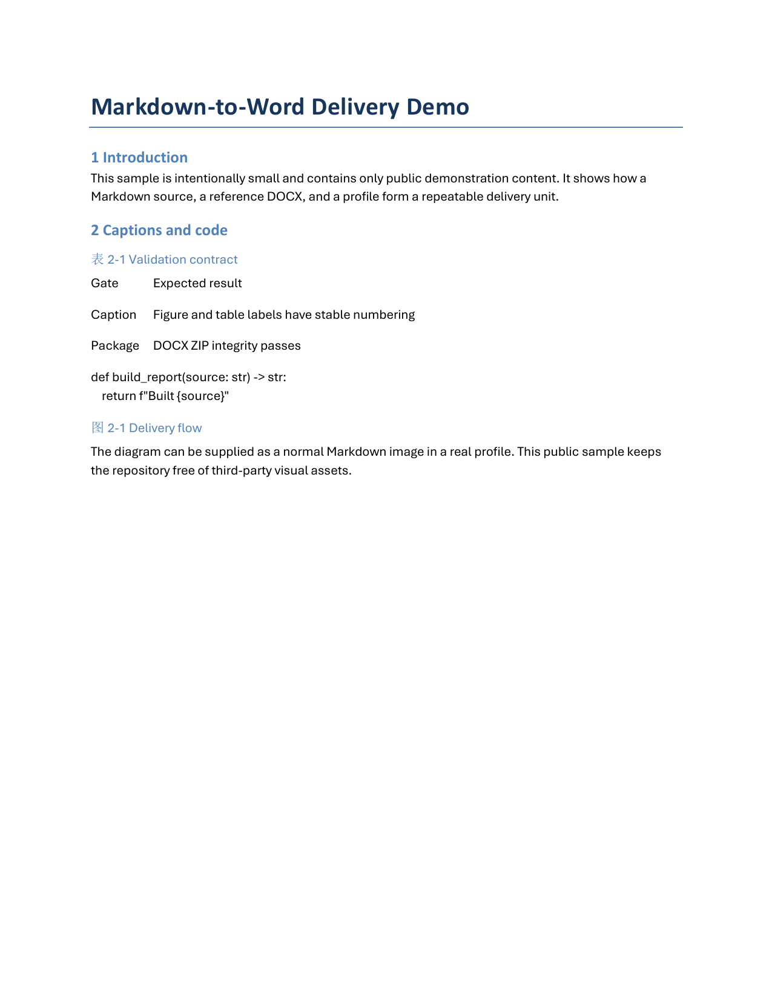

# md2word

**Template-governed Markdown-to-DOCX delivery with structural validation.**

`md2word` is for documents where a polished DOCX is a deliverable, not merely a
format conversion. It combines Pandoc's Markdown conversion with a checked
reference-DOCX profile, targeted OOXML repairs, and an optional Microsoft Word
review pass.



The screenshot is a rendered page from the public example built by this
repository. Its provenance is documented in
[`docs/images/README.md`](docs/images/README.md).

## Why md2word

| Delivery risk | md2word contract |
| --- | --- |
| A converter ignores the required Word template | The profile names a reference DOCX; its styles remain the visual authority. |
| Captions drift or show unstable numbering | Caption text is normalized and written with explicit `SEQ Figure` or `SEQ Table` fields. |
| Heading numbering fields leak into visible text | Validation rejects generated documents that retain `SEQ Chapter` fields. |
| A build silently loses supplied images | Source-image hashes must be present among the DOCX media parts. |
| A file exists but is structurally corrupt | Every build runs DOCX ZIP-integrity and OOXML contract checks. |
| Word has not refreshed field values | On Windows, `--word` updates fields; `--pdf` exports the same reviewed document to PDF. |

The project deliberately keeps the conversion layer separate from a user's
private template and content. That makes the pipeline reusable without turning
project reports, templates, screenshots, or formula libraries into public
dependencies.

## Pipeline

```text
Markdown + local images + profile
  -> Pandoc with a reference DOCX
  -> caption and code-style normalization
  -> DOCX ZIP and OOXML validation
  -> optional Microsoft Word field update and PDF export
```

The public example is intentionally small, but it exercises a title, headings,
a table caption, a figure caption, code, a reference template, and the
post-build validation path.

## Quick Start

Requirements:

- Python 3.11 or newer
- Pandoc available on `PATH`
- Microsoft Word is optional and required only for `--word` or `--pdf`

```powershell
python -m venv .venv
.\.venv\Scripts\Activate.ps1
pip install -e ".[dev]"
python scripts\create_demo_template.py
md2word build examples\demo-report.md --profile profiles\public-demo.toml --out artifacts\demo.docx --overwrite
pytest
```

For a Windows review pass, run:

```powershell
md2word build examples\demo-report.md --profile profiles\public-demo.toml --out artifacts\demo.docx --overwrite --word --pdf artifacts\demo.pdf
```

The CLI reports the output path plus the number of validated captions and
source images. It refuses to overwrite an existing document unless
`--overwrite` is supplied.

## Profiles and Validation

Profiles keep delivery-specific choices out of the converter:

```toml
reference_docx = "../templates/public-demo.docx"
figure_label = "图"
table_label = "表"
code_style = "Normal"
```

Use a profile to select the reference template, figure/table labels, and the
target style for Pandoc code paragraphs. See
[`docs/profiles.md`](docs/profiles.md) for the profile contract.

`md2word` validates the package it writes. It is not a guarantee that a
user-supplied template, image, font, or Word installation meets an external
submission rule. Treat the optional Word/PDF pass as a review stage and inspect
the delivered PDF when visual acceptance matters.

## Boundaries

Native MathType is intentionally opt-in: users must supply their own authorized
Word, MathType, template, and formula bank. The public pipeline supports
Pandoc's Office Math output but does not bundle MathType assets.

Do not publish customer or course reports, institutional or competition
templates, private screenshots, MathType OLE objects, formula banks, or
third-party license material without a redistribution review. Full guidance is
in [`docs/release-boundary.md`](docs/release-boundary.md).

## License

The project-authored code, documentation, public demo template, example, and
README screenshot are licensed under [MIT](LICENSE). Third-party tools,
user-supplied inputs, and material embedded in a user's output retain their
own terms; see [NOTICE.md](NOTICE.md).
