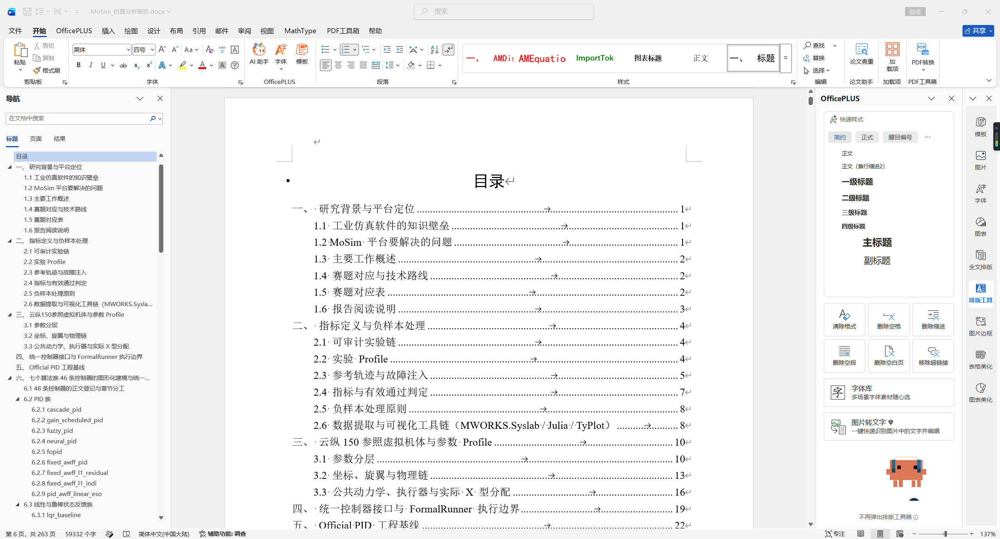
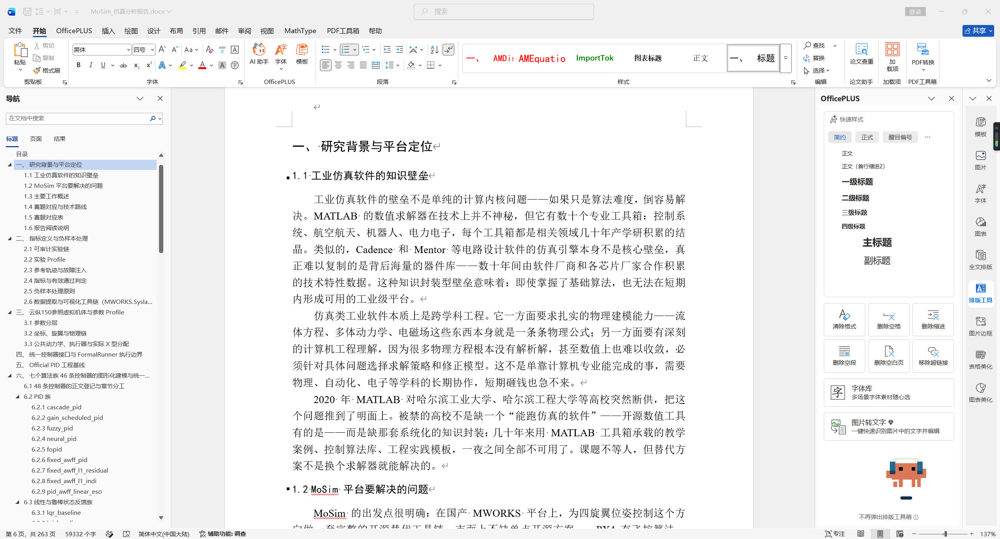
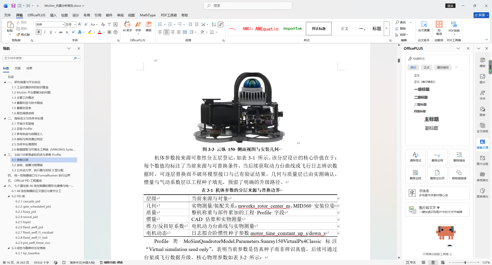
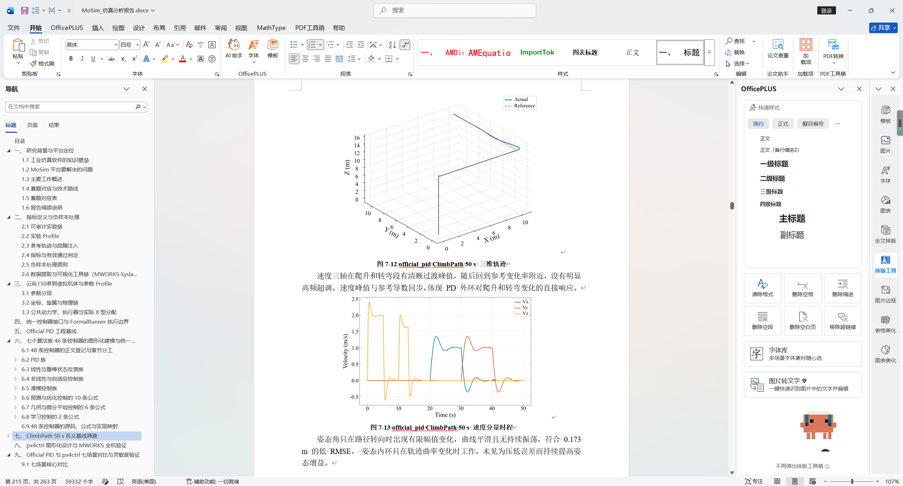
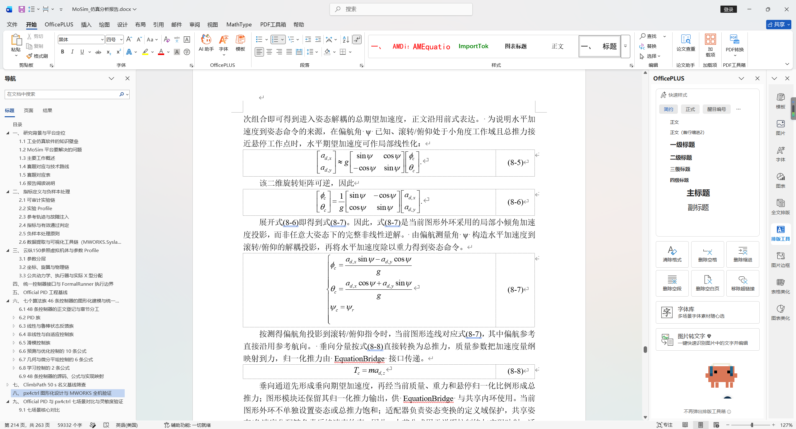
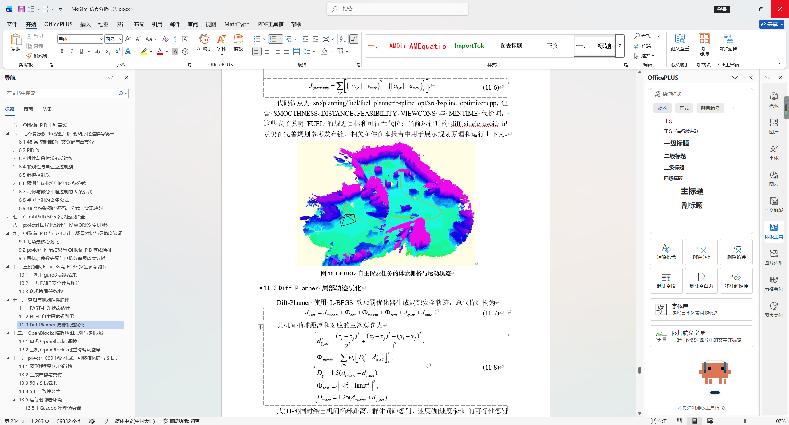
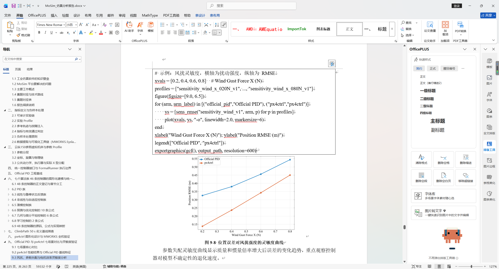
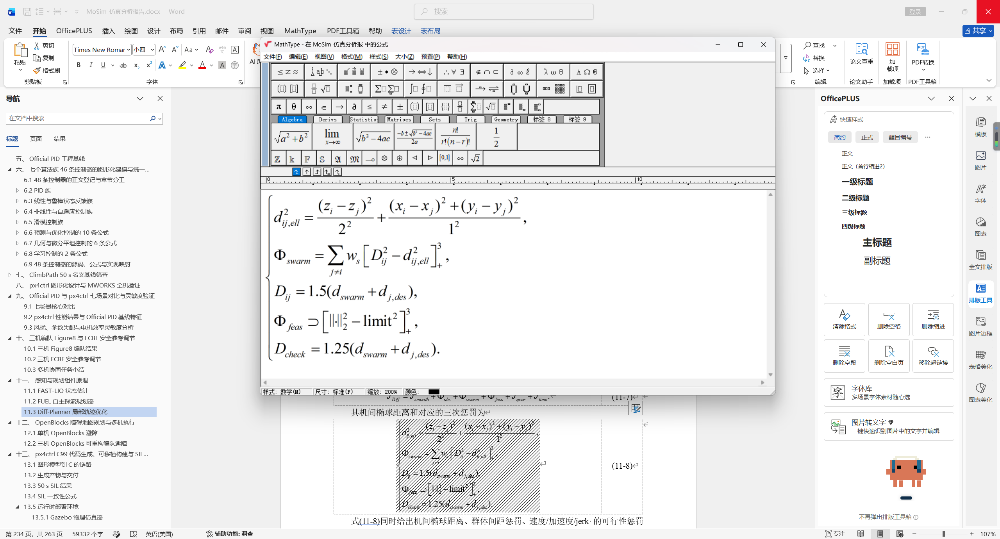

# md2word

**Template-governed Markdown-to-DOCX delivery with structural validation.**

**面向模板约束与结构校验的 Markdown-to-DOCX 交付工具。**

`md2word` is for reports where the DOCX itself is part of the acceptance
criteria. It combines Pandoc conversion with a reference-DOCX profile, focused
OOXML normalization, package checks, and an optional Microsoft Word review
pass. It does not stop at producing a file.

`md2word` 面向“DOCX 本身就是交付物”的场景：在 Pandoc 转换基础上使用参考
DOCX、定点处理 OOXML、执行包结构校验，并可选地通过 Microsoft Word 更新字段和
导出 PDF。它关注的不只是“能生成文件”，而是“能交付、能复核”。

<p align="center">
  <a href="#english">English</a> | <a href="#中文说明">简体中文</a>
</p>

## What A Delivery Looks Like | 交付效果

The screenshots below are project-provided Word review evidence. They show the
document features this workflow is designed to preserve and make reviewable:
a generated table of contents, heading hierarchy, tables, figures, Office Math,
code, and an opt-in MathType editing path. They are visual examples, not a
claim that the small public demo contains the underlying report content.

下列截图由项目提供，作为 Word 审阅效果的可视证据。它们展示本工具要保留并支持
复核的文档能力：目录、标题层级、表格、插图、Office Math 公式、代码和可选的
MathType 编辑路径。截图仅用于展示效果，不表示仓库内的小型公开示例包含其中的
报告内容。

<details open>
<summary><strong>Document structure | 文档结构</strong></summary>




</details>

<details>
<summary><strong>Tables and figures | 表格与插图</strong></summary>




</details>

<details>
<summary><strong>Technical content | 公式、代码与 MathType</strong></summary>








</details>

Asset descriptions and release guidance are in
[`docs/images/README.md`](docs/images/README.md).

<a id="english"></a>

## English

### Why md2word

Most Markdown-to-DOCX tools answer “can Markdown become a Word file?”
`md2word` targets the next question: “can this generated file satisfy a
template-bound delivery review?”

| Delivery risk | md2word contract |
| --- | --- |
| A converter ignores the required Word template | A profile names a reference DOCX; its styles remain the visual authority. |
| Captions drift or show unstable numbering | Caption text is normalized and written with explicit `SEQ Figure` or `SEQ Table` fields. |
| Heading numbering fields leak into visible text | Validation rejects output containing `SEQ Chapter` fields. |
| A build silently loses supplied images | Every source-image hash must appear in the generated DOCX media parts. |
| A file exists but is structurally corrupt | Each build runs DOCX ZIP-integrity and OOXML contract checks. |
| Word has not refreshed field values | On Windows, `--word` updates fields; `--pdf` exports the same reviewed document. |

### Build and Review Path

```text
Markdown + local images + profile
  -> Pandoc with a reference DOCX
  -> caption and code-style normalization
  -> DOCX ZIP and OOXML validation
  -> optional Microsoft Word field update and PDF export
```

The public example deliberately stays small, while still exercising a title,
headings, a table caption, a figure caption, code, a reference template, and
the complete post-build validation path.

### Quick Start

Requirements:

- Python 3.11 or newer
- Pandoc on `PATH`
- Microsoft Word is optional and required only for `--word` or `--pdf`

```powershell
python -m venv .venv
.\.venv\Scripts\Activate.ps1
pip install -e ".[dev]"
python scripts\create_demo_template.py
md2word build examples\demo-report.md --profile profiles\public-demo.toml --out artifacts\demo.docx --overwrite
pytest
```

For a Windows review pass, run:

```powershell
md2word build examples\demo-report.md --profile profiles\public-demo.toml --out artifacts\demo.docx --overwrite --word --pdf artifacts\demo.pdf
```

The CLI prints the output path plus the number of validated captions and source
images. It refuses to replace an existing document without `--overwrite`.

### Profiles and Validation

Profiles keep delivery choices outside the converter:

```toml
reference_docx = "../templates/public-demo.docx"
figure_label = "图"
table_label = "表"
code_style = "Normal"
```

Use a profile to choose the reference template, figure/table labels, and target
style for Pandoc code paragraphs. See [`docs/profiles.md`](docs/profiles.md).

The structural checks prove the package written by this tool meets its stated
contract. They do not by themselves prove that a user-supplied template, font,
image, or Word installation meets an outside submission rule. When visual
acceptance matters, inspect the PDF from the optional Word pass.

### Public Scope

Native MathType remains opt-in. Operators provide their own authorized Word,
MathType, template, and formula bank; this repository supports Pandoc Office
Math but does not distribute MathType assets.

Only project-authored code, documentation, public demo content, and
rights-cleared evidence images belong here. Customer or course reports,
institutional templates, private screenshots, MathType OLE objects, and
third-party license material require a redistribution review. See
[`docs/release-boundary.md`](docs/release-boundary.md) and [NOTICE.md](NOTICE.md).

### License

Project-authored code, documentation, public demo template, example, and
rights-cleared README images are licensed under [MIT](LICENSE). Third-party
tools and user-supplied inputs retain their own terms.

<a id="中文说明"></a>

## 中文说明

### md2word 的优势

普通 Markdown-to-DOCX 工具解决的是“Markdown 能不能转成 Word”。`md2word`
解决的是下一步问题：**生成后的 Word 能否经过模板化交付复核。**

| 交付风险 | md2word 的处理契约 |
| --- | --- |
| 转换器忽略指定 Word 模板 | 配置档明确指定参考 DOCX，模板样式保持为视觉权威。 |
| 图表题注错位或编号不稳定 | 题注文本被规范化，并写入明确的 `SEQ Figure` / `SEQ Table` 字段。 |
| 标题中泄漏字段编号 | 校验会拒绝仍含 `SEQ Chapter` 字段的输出。 |
| 构建过程静默遗漏图片 | 每张源图的哈希必须出现在生成 DOCX 的媒体部件中。 |
| 文件存在但 DOCX 包已损坏 | 每次构建都会执行 DOCX ZIP 完整性与 OOXML 契约校验。 |
| Word 尚未更新字段显示值 | Windows 下 `--word` 更新字段，`--pdf` 导出同一份复核后的文档。 |

### 生成与复核链路

```text
Markdown + 本地图片 + 配置档
  -> 使用参考 DOCX 的 Pandoc 转换
  -> 题注与代码样式规范化
  -> DOCX ZIP 与 OOXML 校验
  -> 可选的 Microsoft Word 字段更新和 PDF 导出
```

公开示例刻意保持简洁，但已覆盖标题、各级标题、表题注、图题注、代码、参考模板与
完整的构建后验证链路。

### 快速开始

环境要求：

- Python 3.11 或更高版本
- 已将 Pandoc 加入 `PATH`
- Microsoft Word 为可选项，仅 `--word` 或 `--pdf` 需要

```powershell
python -m venv .venv
.\.venv\Scripts\Activate.ps1
pip install -e ".[dev]"
python scripts\create_demo_template.py
md2word build examples\demo-report.md --profile profiles\public-demo.toml --out artifacts\demo.docx --overwrite
pytest
```

需要在 Windows 上完成字段更新与 PDF 复核时，执行：

```powershell
md2word build examples\demo-report.md --profile profiles\public-demo.toml --out artifacts\demo.docx --overwrite --word --pdf artifacts\demo.pdf
```

CLI 会输出目标文件路径、已校验题注数量与源图片数量；未传入 `--overwrite` 时，
不会覆盖已存在的 Word 文件。

### 配置档与校验

配置档把每个交付任务的差异与转换器主体分离：

```toml
reference_docx = "../templates/public-demo.docx"
figure_label = "图"
table_label = "表"
code_style = "Normal"
```

它定义参考模板、图表标签和 Pandoc 代码段落的目标样式。具体配置约束见
[`docs/profiles.md`](docs/profiles.md)。

结构校验能够证明本工具写出的 DOCX 满足已声明的包与字段契约，但不能单独证明用户
自备模板、字体、图片或 Word 环境已经满足外部投稿/交付规则。视觉验收有要求时，仍应
检查可选 Word 阶段输出的 PDF。

### 公开边界

原生 MathType 是可选能力：使用者必须自备有权使用的 Word、MathType、模板和公式库。
本仓库支持 Pandoc Office Math，但不分发 MathType 资产。

仓库仅收录项目自行编写的代码、文档、公开示例与已完成权利审查的证据图片。客户或
课程报告、机构模板、私有截图、MathType OLE 对象及第三方许可证材料都必须先完成
再分发审查。详见 [`docs/release-boundary.md`](docs/release-boundary.md) 和
[NOTICE.md](NOTICE.md)。

### 许可证

项目自行编写的代码、文档、公开演示模板、示例和已完成权利审查的 README 图片使用
[MIT](LICENSE) 许可证。第三方工具与用户自备输入材料仍适用其各自的许可条款。
